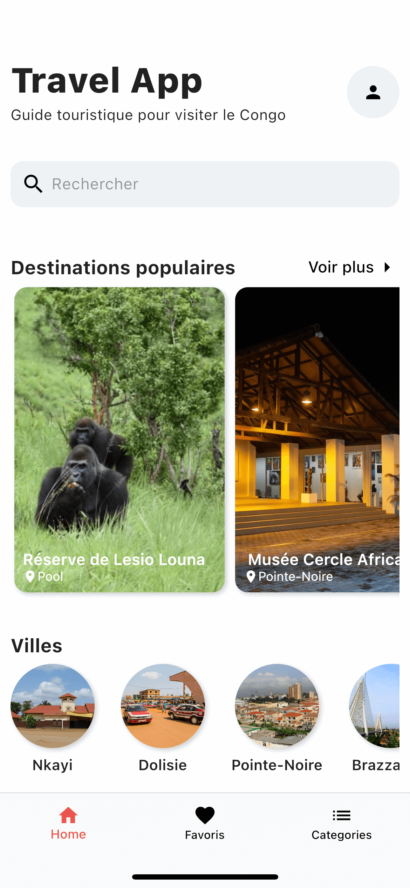
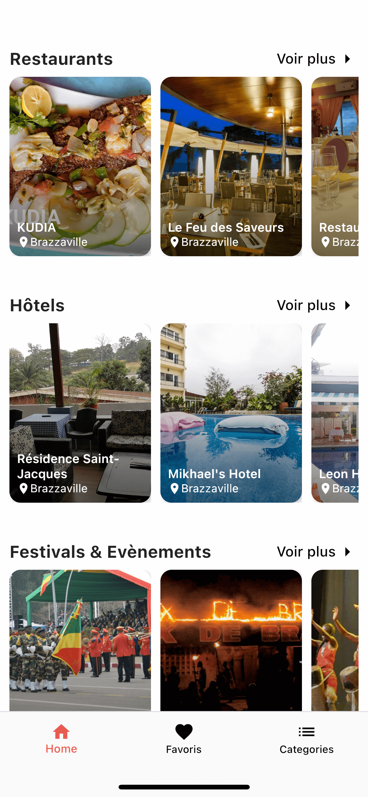
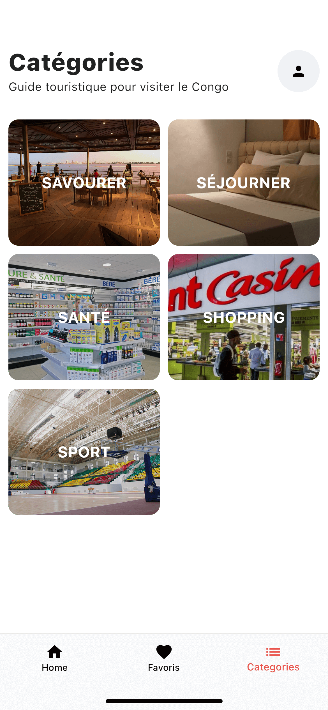

# Travel App - Flutter UI

A new Flutter project.

## Getting Started

## Development Setup
Clone the repository and run the following commands:
```
flutter pub get
flutter run
```

## ScreenShots

&nbsp;&nbsp;&nbsp;&nbsp;&nbsp;&nbsp;


